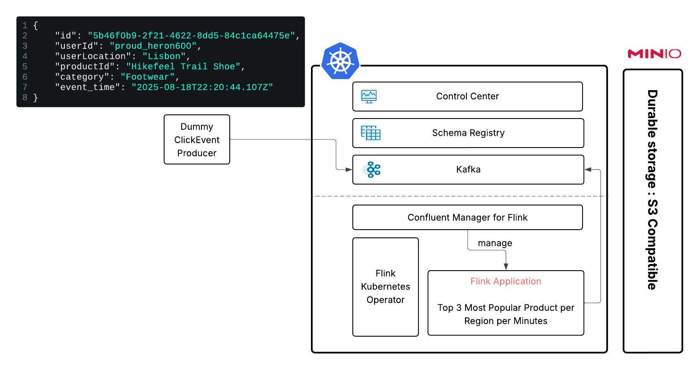

# Setup 

## Start Ingress Ready Cluster

``` bash
cat <<EOF | kind create cluster --name cp-flink --config=-
kind: Cluster
apiVersion: kind.x-k8s.io/v1alpha4
nodes:
- role: control-plane
  kubeadmConfigPatches:
  - |
    kind: InitConfiguration
    nodeRegistration:
      kubeletExtraArgs:
        node-labels: "ingress-ready=true"
  extraPortMappings:
  - containerPort: 80
    hostPort: 80
    protocol: TCP
  - containerPort: 443
    hostPort: 443
    protocol: TCP
EOF
```

``` bash
kubectl cluster-info --context kind-cp-flink
```

## Install Kafka

``` bash
kubectl create namespace confluent
kubectl config set-context --current --namespace=confluent
helm repo add confluentinc https://packages.confluent.io/helm
helm repo update
helm upgrade --install operator confluentinc/confluent-for-kubernetes

kubectl apply -f setup/kafka.yaml

watch kubectl -n confluent get pods

kubectl -n confluent port-forward controlcenter-ng-0 9021:9021 > /dev/null 2>&1 &
```

## Install Confluent Manager for Apache Flink

``` bash
kubectl create ns flink-clusters

kubectl create -f https://github.com/jetstack/cert-manager/releases/download/v1.8.2/cert-manager.yaml

watch kubectl get endpoints -n cert-manager cert-manager-webhook

kubectl config set-context --current --namespace=confluent
helm upgrade --install cp-flink-kubernetes-operator --version "~1.120.0" confluentinc/flink-kubernetes-operator --set watchNamespaces="{flink-clusters,confluent}"

helm upgrade --install cmf confluentinc/confluent-manager-for-apache-flink \
    --set cmf.sql.production=false \
    --namespace confluent

watch kubectl -n confluent get pods

kubectl port-forward service/cmf-service 8080:80 -n confluent > /dev/null 2>&1 &
```

## Durable Storage

``` bash
kubectl create ns minio-dev

kubectl -n minio-dev create -f setup/minio/minio.yaml

watch kubectl get pods -n minio-dev

kubectl -n minio-dev create -f setup/minio/minio-rest.yaml

kubectl apply -f https://raw.githubusercontent.com/kubernetes/ingress-nginx/main/deploy/static/provider/kind/deploy.yaml


kubectl wait --namespace ingress-nginx \
  --for=condition=ready pod \
  --selector=app.kubernetes.io/component=controller \
  --timeout=90s

kubectl -n minio-dev create -f setup/minio/minio-web.yaml
```

We can now login in MinIO (user: minioadmin password: minioadmin):

http://localhost/browser

# Application

## Use cases



## Kafka Resources

``` bash
kubectl apply -f app/kafka-topics.yaml
```

> FOR KAFKA TROUBLESHOOTING (NOT MANDATORY)
``` bash
kubectl port-forward service/kafka 9092:9092 -n confluent > /dev/null 2>&1 &
kubectl port-forward service/schemaregistry 8084:8081 -n confluent > /dev/null 2>&1 &
```

``` bash
cd app/click-producer

mvn package
docker build . -t clickstream-producer:latest

kind load docker-image clickstream-producer:latest -n cp-flink

kubectl create ns producer

cd ../../

kubectl apply -f app/producer.yaml -n producer
```

## Flink Job (simple count per category)

``` bash
cd app/flink-count-app
mvn package

docker build . -t flink-count-job:latest

kind load docker-image flink-count-job:latest -n cp-flink
```

Create S3 Bucket : clickeventcount

And now create our environment/app:

``` bash
confluent flink environment create clickcount --url http://localhost:8080 --kubernetes-namespace flink-clusters --defaults app/flink_env_cp.json

confluent flink application create app/flink-count-app.json --environment clickcount --url http://localhost:8080

kubectl exec schemaregistry-0 -n confluent -- kafka-avro-console-consumer --bootstrap-server kafka.confluent.svc.cluster.local:9071 --topic clickstreamagg --property print.timestamp=true --property print.key=true --property print.value=true
```


>> DELETE 

``` bash
confluent flink application delete clickeventcount-app --environment clickcount --url http://localhost:8080
confluent flink environment delete clickcount --url http://localhost:8080
```

## Flink Job (TOP 3 most popular product per region)

``` bash
cd app/flink-popular-product
mvn package

docker build . -t flink-popular-product-job:latest

kind load docker-image flink-popular-product-job:latest -n cp-flink
```

Create S3 Bucket : clickeventpopularproduct

``` bash
cd ../..

confluent flink application create app/flink-pop-product-app.json --environment clickcount --url http://localhost:8080

kubectl exec schemaregistry-0 -n confluent -- kafka-avro-console-consumer --bootstrap-server kafka.confluent.svc.cluster.local:9071 --topic popularproduct --property print.timestamp=true --property print.key=true --property print.value=true
```

``` bash
confluent flink application delete popularproduct-app --environment clickcount --url http://localhost:8080
confluent flink environment delete clickcount --url http://localhost:8080
```

# Drop resources

``` bash
kind delete cluster --name cp-flink
```